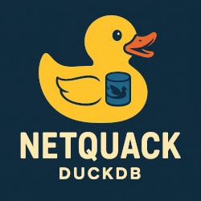

# DuckDB Netquack Extension

[](https://duckdb.org/community_extensions/extensions/netquack.html) [](https://github.com/hatamiarash7/duckdb-netquack/blob/main/LICENSE) [](https://github.com/hatamiarash7/duckdb-netquack/releases/latest)



This extension is designed to simplify working with domains, URIs, and web paths directly within your database queries. Whether you're extracting top-level domains (TLDs), parsing URI components, or analyzing web paths, Netquack provides a suite of intuitive functions to handle all your network tasks efficiently. Built for data engineers, analysts, and developers.

With Netquack, you can unlock deeper insights from your web-related datasets without the need for external tools or complex workflows.

NetQuack uses ClickHouse-inspired character-by-character parsing and gperf-generated perfect hash functions for optimal performance.

Table of Contents

- [DuckDB Netquack Extension](#duckdb-netquack-extension)
  - [Installation 🚀](#installation-)
  - [Usage Examples 📚](#usage-examples-)
    - [Extracting The Main Domain](#extracting-the-main-domain)
    - [Extracting The Path](#extracting-the-path)
    - [Extracting The Host](#extracting-the-host)
    - [Extracting The Schema](#extracting-the-schema)
    - [Extracting The Query](#extracting-the-query)
      - [Query String](#query-string)
      - [Query Parameters](#query-parameters)
    - [Extracting The Port](#extracting-the-port)
    - [Extracting The File Extension](#extracting-the-file-extension)
    - [Extracting The TLD (Top-Level Domain)](#extracting-the-tld-top-level-domain)
    - [Extracting The Sub Domain](#extracting-the-sub-domain)
    - [Get Tranco Rank](#get-tranco-rank)
      - [Update Tranco List](#update-tranco-list)
      - [Get Tranco Ranking](#get-tranco-ranking)
    - [IP Address Functions](#ip-address-functions)
      - [IP Calculator](#ip-calculator)
    - [Get Extension Version](#get-extension-version)
  - [Build Requirements](#build-requirements)
  - [Debugging](#debugging)
  - [Roadmap 🗺️](#roadmap-️)
  - [Contributing 🤝](#contributing-)
  - [Issues 🐛](#issues-)

## Installation 🚀

**netquack** is distributed as a [DuckDB Community Extension](https://duckdb.org/community_extensions/) and can be installed using SQL:

```sql
INSTALL netquack FROM community;
LOAD netquack;
```

If you previously installed the `netquack` extension, upgrade using the FORCE command

```sql
FORCE INSTALL netquack FROM community;
LOAD netquack;
```

## Usage Examples 📚

Once installed, the [macro functions](https://duckdb.org/community_extensions/extensions/netquack.html#added-functions) provided by the extension can be used just like built-in functions.

### Extracting The Main Domain

This function extracts the main domain from a URL using an optimized static TLD lookup system. The extension uses Mozilla's Public Suffix List compiled into a gperf-generated perfect hash function for O(1) TLD lookups with zero collisions.

```sql
D SELECT extract_domain('a.example.com') AS domain;
┌─────────────┐
│   domain    │
│   varchar   │
├─────────────┤
│ example.com │
└─────────────┘

D SELECT extract_domain('https://b.a.example.com/path') AS domain;
┌─────────────┐
│   domain    │
│   varchar   │
├─────────────┤
│ example.com │
└─────────────┘
```

The TLD lookup is built into the extension at compile time using the latest Mozilla Public Suffix List. No runtime downloads or database operations are required.

### Extracting The Path

This function extracts the path from a URL.

```sql
D SELECT extract_path('https://b.a.example.com/path/path') AS path;
┌────────────┐
│    path    │
│  varchar   │
├────────────┤
│ /path/path │
└────────────┘

D SELECT extract_path('example.com/path/path/image.png') AS path;
┌──────────────────────┐
│         path         │
│       varchar        │
├──────────────────────┤
│ /path/path/image.png │
└──────────────────────┘
```

### Extracting The Host

This function extracts the host from a URL.

```sql
D SELECT extract_host('https://b.a.example.com/path/path') AS host;
┌─────────────────┐
│      host       │
│     varchar     │
├─────────────────┤
│ b.a.example.com │
└─────────────────┘

D SELECT extract_host('example.com:443/path/image.png') AS host;
┌─────────────┐
│    host     │
│   varchar   │
├─────────────┤
│ example.com │
└─────────────┘
```

### Extracting The Schema

This function extracts the schema from a URL. Supported schemas for now:

- `http` | `https`
- `ftp`
- `mailto`
- `tel` | `sms`

```sql
D SELECT extract_schema('https://b.a.example.com/path/path') AS schema;
┌─────────┐
│ schema  │
│ varchar │
├─────────┤
│ https   │
└─────────┘

D SELECT extract_schema('mailto:someone@example.com') AS schema;
┌─────────┐
│ schema  │
│ varchar │
├─────────┤
│ mailto  │
└─────────┘

D SELECT extract_schema('tel:+123456789') AS schema;
┌─────────┐
│ schema  │
│ varchar │
├─────────┤
│ tel     │
└─────────┘
```

### Extracting The Query

#### Query String

The `extract_query_string` function extracts the query string from a URL as a single string.

```sql
D SELECT extract_query_string('example.com?key=value') AS query;
┌───────────┐
│   query   │
│  varchar  │
├───────────┤
│ key=value │
└───────────┘

D SELECT extract_query_string('http://example.com.ac/path/?a=1&b=2') AS query;
┌─────────┐
│  query  │
│ varchar │
├─────────┤
│ a=1&b=2 │
└─────────┘
```

#### Query Parameters

The `extract_query_parameters` table function parses the query string and returns each key-value pair as a separate row. This is useful for analyzing URL parameters in a structured way.

```sql
D SELECT * FROM extract_query_parameters('http://example.com/path/?a=1&b=2');
┌─────────┬─────────┐
│   key   │  value  │
│ varchar │ varchar │
├─────────┼─────────┤
│ a       │ 1       │
│ b       │ 2       │
└─────────┴─────────┘

D SELECT * FROM extract_query_parameters('https://example.com/search?q=duckdb&hl=en&num=10');
┌─────────┬─────────┐
│   key   │  value  │
│ varchar │ varchar │
├─────────┼─────────┤
│ q       │ duckdb  │
│ hl      │ en      │
│ num     │ 10      │
└─────────┴─────────┘
```

### Extracting The Port

This function extracts the port from a URL.

```sql
D SELECT extract_port('https://example.com:8443/') AS port;
┌─────────┐
│  port   │
│ varchar │
├─────────┤
│ 8443    │
└─────────┘

D SELECT extract_port('[::1]:6379') AS port;
┌─────────┐
│  port   │
│ varchar │
├─────────┤
│ 6379    │
└─────────┘
```

### Extracting The File Extension

This function extracts the file extension from a URL. It will return the file extension without the dot.

```sql
D SELECT extract_extension('http://example.com/image.jpg') AS ext;
┌─────────┐
│   ext   │
│ varchar │
├─────────┤
│ jpg     │
└─────────┘
```

### Extracting The TLD (Top-Level Domain)

This function extracts the top-level domain from a URL using the optimized gperf-based public suffix lookup system. The function correctly handles multi-part TLDs (like `com.au`) using the longest-match algorithm from Mozilla's Public Suffix List.

```sql
D SELECT extract_tld('https://example.com.ac/path/path') AS tld;
┌─────────┐
│   tld   │
│ varchar │
├─────────┤
│ com.ac  │
└─────────┘

D SELECT extract_tld('a.example.com') AS tld;
┌─────────┐
│   tld   │
│ varchar │
├─────────┤
│ com     │
└─────────┘
```

### Extracting The Sub Domain

This function extracts the sub-domain from a URL using the optimized public suffix lookup system to correctly identify the domain boundary and extract everything before it.

```sql
D SELECT extract_subdomain('http://a.b.example.com/path') AS dns_record;
┌────────────┐
│ dns_record │
│  varchar   │
├────────────┤
│ a.b        │
└────────────┘

D SELECT extract_subdomain('test.example.com.ac') AS dns_record;
┌────────────┐
│ dns_record │
│  varchar   │
├────────────┤
│ test       │
└────────────┘
```

### Get Tranco Rank

#### Update Tranco List

This function returns the [Tranco](https://tranco-list.eu/) rank of a domain. You have an `update_tranco` function to update the Tranco list manually.

```sql
D SELECT update_tranco(true);
┌─────────────────────────────────────┐
│ update_tranco(CAST('f' AS BOOLEAN)) │
│               varchar               │
├─────────────────────────────────────┤
│ Tranco list updated                 │
└─────────────────────────────────────┘
```

This function will get the latest Tranco list and save it into the `tranco_list` table. There will be a `tranco_list_%Y-%m-%d.csv` file in the current directory after the function is called. The extension will use this file to prevent downloading the list again.

You can ignore the file and force the extension to download the list again by calling the function with `true` as a parameter. If you don't want to download the list again, you can call the function with `false` as a parameter.

```sql
D SELECT update_tranco(false);
```

As the latest Tranco list is for the last day, you can download your list manually and rename it to `tranco_list_%Y-%m-%d.csv` to use it with the extension too.

#### Get Tranco Ranking

You can use this function to get the ranking of a domain:

```sql
D SELECT get_tranco_rank('microsoft.com') AS rank;
┌─────────┐
│  rank   │
│ varchar │
├─────────┤
│ 2       │
└─────────┘

D SELECT get_tranco_rank('cloudflare.com') AS rank;
┌─────────┐
│  rank   │
│ varchar │
├─────────┤
│ 13      │
└─────────┘
```

You can use the `get_tranco_rank_category` function to retrieve the category utility column that gives you the domain's rank category. The `category` value is on a log10 scale with half steps (e.g., top 1k, top 5k, top 10k, top 50k, top 100k, top 500k, top 1M, top 5m, etc.), with each rank excluding the previous (e.g., top 5k is actually 4k domains, excluding top 1k).

```sql
D SELECT get_tranco_rank_category('microsoft.com') AS category;
┌──────────┐
│ category │
│ varchar  │
├──────────┤
│ top1k    │
└──────────┘
```

### IP Address Functions

This extension provides various functions for manipulating and analyzing IP addresses, including calculating networks, hosts, and subnet masks.

#### IP Calculator

> [!WARNING]
> It's an experimental function.

The `ipcalc` function takes an IP address and netmask and calculates the resulting broadcast, network, wildcard mask, and host range.


```sql
SELECT * FROM ipcalc('192.168.1.0/24');
```

It's a table function that provides various details about IP addresses, including:

- Address
- Netmask
- Wildcard
- Network / Hostroute
- HostMin
- HostMax
- Broadcast
- Hosts count

You can use this table function with your data easily:

```sql
D CREATE OR REPLACE TABLE ips AS SELECT '127.0.0.1' AS ip UNION ALL SELECT '192.168.1.0/22';

D SELECT i.IP,
      (
          SELECT hostsPerNet
          FROM ipcalc(i.IP)
      ) AS hosts
  FROM ips AS i;
┌────────────────┬───────┐
│       ip       │ hosts │
│    varchar     │ int64 │
├────────────────┼───────┤
│ 127.0.0.1      │   254 │
│ 192.168.1.0/22 │  1022 │
└────────────────┴───────┘
```

### Get Extension Version

You can use the `netquack_version` function to get the extension version.

```sql
D SELECT * FROM netquack_version();
┌─────────┐
│ version │
│ varchar │
├─────────┤
│ v1.7.0  │
└─────────┘
```

## Build Requirements

- **C++ compiler**: Needs C++17 or later (e.g., `g++`, `clang++`).
- **gperf**: Perfect hash generation requires `gperf`.
- **CMake**
- **GNU Make**

```bash
# On Debian-based systems
sudo apt-get install gperf cmake make

# On MacOS using Homebrew
brew install gperf cmake make
```

## Debugging

The debugging process for DuckDB extensions is not an easy job. For Netquack, we have created a log file in the current directory. The log file is named `netquack.log` and contains all the logs for the extension. You can use this file to debug your code.

Also, there will be stdout errors for background tasks like CURL.

## Roadmap 🗺️

- [ ] Implement `extract_custom_format` function
- [ ] Implement `parse_uri` function
- [ ] Save Tranco data as Parquet
- [ ] Implement GeoIP functionality
- [ ] Return default value for `get_tranco_rank`
- [ ] Support internationalized domain names (IDNs)

## Contributing 🤝

Don't be shy and reach out to us if you want to contribute 😉

1. Fork it!
2. Create your feature branch: `git checkout -b my-new-feature`
3. Commit your changes: `git commit -am 'Add some feature'`
4. Push to the branch: `git push origin my-new-feature`
5. Submit a pull request

## Issues 🐛

Each project may have many problems. Contributing to the better development of this project by [reporting them](https://github.com/hatamiarash7/duckdb-netquack/issues). 👍
