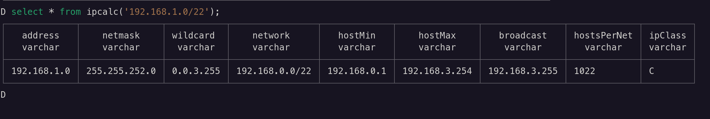

# DuckDB Netquack Extension

[](https://duckdb.org/community_extensions/extensions/netquack.html) [](https://github.com/hatamiarash7/duckdb-netquack/blob/main/LICENSE) [](https://github.com/hatamiarash7/duckdb-netquack/releases/latest)


This extension is designed to simplify working with domains, URIs, and web paths directly within your database queries. Whether you're extracting top-level domains (TLDs), parsing URI components, or analyzing web paths, Netquack provides a suite of intuitive functions to handle all your network tasks efficiently. Built for data engineers, analysts, and developers.

With Netquack, you can unlock deeper insights from your web-related datasets without the need for external tools or complex workflows.

NetQuack uses ClickHouse-inspired character-by-character parsing and gperf-generated perfect hash functions for optimal performance.

Table of Contents

- [DuckDB Netquack Extension](#duckdb-netquack-extension)
  - [Installation 🚀](#installation-)
  - [Usage Examples 📚](#usage-examples-)
    - [Extracting The Main Domain](#extracting-the-main-domain)
    - [Extracting The Path](#extracting-the-path)
    - [Extracting The Host](#extracting-the-host)
    - [Extracting The Schema](#extracting-the-schema)
    - [Extracting The Query](#extracting-the-query)
      - [Query String](#query-string)
      - [Query Parameters](#query-parameters)
    - [Extracting The Port](#extracting-the-port)
    - [Extracting The File Extension](#extracting-the-file-extension)
    - [Extracting The TLD (Top-Level Domain)](#extracting-the-tld-top-level-domain)
    - [Extracting The Sub Domain](#extracting-the-sub-domain)
    - [Extracting The Fragment](#extracting-the-fragment)
    - [Get Tranco Rank](#get-tranco-rank)
      - [Update Tranco List](#update-tranco-list)
      - [Get Tranco Ranking](#get-tranco-ranking)
    - [IP Address Functions](#ip-address-functions)
      - [IP Calculator](#ip-calculator)
      - [Validate IP Address](#validate-ip-address)
      - [Check Private IP](#check-private-ip)
      - [IP Version](#ip-version)
      - [IP to Integer / Integer to IP](#ip-to-integer--integer-to-ip)
    - [Normalize URL](#normalize-url)
    - [Domain Depth](#domain-depth)
    - [Base64 Encode / Decode](#base64-encode--decode)
    - [Validate URL](#validate-url)
    - [Validate Domain](#validate-domain)
    - [Extract Path Segments](#extract-path-segments)
    - [URL Encode / Decode](#url-encode--decode)
    - [Get Extension Version](#get-extension-version)
  - [Build Requirements](#build-requirements)
  - [Debugging](#debugging)
  - [Roadmap 🗺️](#roadmap-️)
  - [Contributing 🤝](#contributing-)
  - [Issues 🐛](#issues-)

## Installation 🚀

**netquack** is distributed as a [DuckDB Community Extension](https://duckdb.org/community_extensions/) and can be installed using SQL:

```sql
SET allow_community_extensions = true;
INSTALL netquack FROM community;
LOAD netquack;
```

If you previously installed the `netquack` extension, upgrade using the FORCE command

```sql
FORCE INSTALL netquack FROM community;
LOAD netquack;
```

Also, you can check for any available updates for the extension using this command:

```sql
UPDATE EXTENSIONS (netquack);
```

## Usage Examples 📚

Once installed, the [macro functions](https://duckdb.org/community_extensions/extensions/netquack.html#added-functions) provided by the extension can be used just like built-in functions.

### Extracting The Main Domain

This function extracts the main domain from a URL using an optimized static TLD lookup system. The extension uses Mozilla's Public Suffix List compiled into a gperf-generated perfect hash function for O(1) TLD lookups with zero collisions.

```sql
D SELECT extract_domain('a.example.com') AS domain;
┌─────────────┐
│   domain    │
│   varchar   │
├─────────────┤
│ example.com │
└─────────────┘

D SELECT extract_domain('https://b.a.example.com/path') AS domain;
┌─────────────┐
│   domain    │
│   varchar   │
├─────────────┤
│ example.com │
└─────────────┘
```

The TLD lookup is built into the extension at compile time using the latest Mozilla Public Suffix List. No runtime downloads or database operations are required.

### Extracting The Path

This function extracts the path from a URL.

```sql
D SELECT extract_path('https://b.a.example.com/path/path') AS path;
┌────────────┐
│    path    │
│  varchar   │
├────────────┤
│ /path/path │
└────────────┘

D SELECT extract_path('example.com/path/path/image.png') AS path;
┌──────────────────────┐
│         path         │
│       varchar        │
├──────────────────────┤
│ /path/path/image.png │
└──────────────────────┘
```

### Extracting The Host

This function extracts the host from a URL.

```sql
D SELECT extract_host('https://b.a.example.com/path/path') AS host;
┌─────────────────┐
│      host       │
│     varchar     │
├─────────────────┤
│ b.a.example.com │
└─────────────────┘

D SELECT extract_host('example.com:443/path/image.png') AS host;
┌─────────────┐
│    host     │
│   varchar   │
├─────────────┤
│ example.com │
└─────────────┘
```

### Extracting The Schema

This function extracts the schema from a URL. Supported schemas for now:

- `http` | `https`
- `ftp`
- `mailto`
- `tel` | `sms`

```sql
D SELECT extract_schema('https://b.a.example.com/path/path') AS schema;
┌─────────┐
│ schema  │
│ varchar │
├─────────┤
│ https   │
└─────────┘

D SELECT extract_schema('mailto:someone@example.com') AS schema;
┌─────────┐
│ schema  │
│ varchar │
├─────────┤
│ mailto  │
└─────────┘

D SELECT extract_schema('tel:+123456789') AS schema;
┌─────────┐
│ schema  │
│ varchar │
├─────────┤
│ tel     │
└─────────┘
```

### Extracting The Query

#### Query String

The `extract_query_string` function extracts the query string from a URL as a single string.

```sql
D SELECT extract_query_string('example.com?key=value') AS query;
┌───────────┐
│   query   │
│  varchar  │
├───────────┤
│ key=value │
└───────────┘

D SELECT extract_query_string('http://example.com.ac/path/?a=1&b=2') AS query;
┌─────────┐
│  query  │
│ varchar │
├─────────┤
│ a=1&b=2 │
└─────────┘
```

#### Query Parameters

The `extract_query_parameters` table function parses the query string and returns each key-value pair as a separate row. This is useful for analyzing URL parameters in a structured way.

```sql
D SELECT * FROM extract_query_parameters('http://example.com/path/?a=1&b=2');
┌─────────┬─────────┐
│   key   │  value  │
│ varchar │ varchar │
├─────────┼─────────┤
│ a       │ 1       │
│ b       │ 2       │
└─────────┴─────────┘

D SELECT * FROM extract_query_parameters('https://example.com/search?q=duckdb&hl=en&num=10');
┌─────────┬─────────┐
│   key   │  value  │
│ varchar │ varchar │
├─────────┼─────────┤
│ q       │ duckdb  │
│ hl      │ en      │
│ num     │ 10      │
└─────────┴─────────┘

D SELECT m.media_url,
  e.key,
  e.value
FROM instagram_posts m,
  LATERAL extract_query_parameters(m.media_url) e
ORDER BY m.id;

┌───────────────────────────────────────────────────────────────────────────────────────────┬────────────┬───────────┐
│                                         media_url                                         │    key     │   value   │
│                                          varchar                                          │  varchar   │  varchar  │
├───────────────────────────────────────────────────────────────────────────────────────────┼────────────┼───────────┤
│ https://cdn.instagram.com/media/abc123.jpg?utm_source=instagram&utm_medium=social&id=1001 │ id         │ 1001      │
│ https://cdn.instagram.com/media/abc123.jpg?utm_source=instagram&utm_medium=social&id=1001 │ utm_medium │ social    │
│ https://cdn.instagram.com/media/abc123.jpg?utm_source=instagram&utm_medium=social&id=1001 │ utm_source │ instagram │
│ https://cdn.instagram.com/media/def456.jpg?quality=hd&format=webp&user=arash              │ user       │ arash     │
│ https://cdn.instagram.com/media/def456.jpg?quality=hd&format=webp&user=arash              │ format     │ webp      │
│ https://cdn.instagram.com/media/def456.jpg?quality=hd&format=webp&user=arash              │ quality    │ hd        │
│ https://cdn.instagram.com/media/ghi789.mp4?autoplay=true&loop=false&session_id=xyz987     │ session_id │ xyz987    │
│ https://cdn.instagram.com/media/ghi789.mp4?autoplay=true&loop=false&session_id=xyz987     │ loop       │ false     │
│ https://cdn.instagram.com/media/ghi789.mp4?autoplay=true&loop=false&session_id=xyz987     │ autoplay   │ true      │
└───────────────────────────────────────────────────────────────────────────────────────────┴────────────┴───────────┘
```

### Extracting The Port

This function extracts the port from a URL.

```sql
D SELECT extract_port('https://example.com:8443/') AS port;
┌─────────┐
│  port   │
│ varchar │
├─────────┤
│ 8443    │
└─────────┘

D SELECT extract_port('[::1]:6379') AS port;
┌─────────┐
│  port   │
│ varchar │
├─────────┤
│ 6379    │
└─────────┘
```

### Extracting The File Extension

This function extracts the file extension from a URL. It will return the file extension without the dot.

```sql
D SELECT extract_extension('http://example.com/image.jpg') AS ext;
┌─────────┐
│   ext   │
│ varchar │
├─────────┤
│ jpg     │
└─────────┘
```

### Extracting The TLD (Top-Level Domain)

This function extracts the top-level domain from a URL using the optimized gperf-based public suffix lookup system. The function correctly handles multi-part TLDs (like `com.au`) using the longest-match algorithm from Mozilla's Public Suffix List.

```sql
D SELECT extract_tld('https://example.com.ac/path/path') AS tld;
┌─────────┐
│   tld   │
│ varchar │
├─────────┤
│ com.ac  │
└─────────┘

D SELECT extract_tld('a.example.com') AS tld;
┌─────────┐
│   tld   │
│ varchar │
├─────────┤
│ com     │
└─────────┘
```

### Extracting The Sub Domain

This function extracts the sub-domain from a URL using the optimized public suffix lookup system to correctly identify the domain boundary and extract everything before it.

```sql
D SELECT extract_subdomain('http://a.b.example.com/path') AS dns_record;
┌────────────┐
│ dns_record │
│  varchar   │
├────────────┤
│ a.b        │
└────────────┘

D SELECT extract_subdomain('test.example.com.ac') AS dns_record;
┌────────────┐
│ dns_record │
│  varchar   │
├────────────┤
│ test       │
└────────────┘
```

### Extracting The Fragment

The `extract_fragment` function extracts the fragment (the part after `#`) from a URL. Fragments are commonly used for page anchors, SPA routing, and deep linking.

```sql
D SELECT extract_fragment('http://example.com/page#section') AS fragment;
┌──────────┐
│ fragment │
│ varchar  │
├──────────┤
│ section  │
└──────────┘

D SELECT extract_fragment('http://example.com/path?q=1#results') AS fragment;
┌──────────┐
│ fragment │
│ varchar  │
├──────────┤
│ results  │
└──────────┘

D SELECT extract_fragment('http://example.com/#/users/123/profile') AS fragment;
┌────────────────────┐
│      fragment      │
│      varchar       │
├────────────────────┤
│ /users/123/profile │
└────────────────────┘
```

Returns an empty string when no fragment is present, and `NULL` for `NULL` input.

### Get Tranco Rank

#### Update Tranco List

This function returns the [Tranco](https://tranco-list.eu/) rank of a domain. You have an `update_tranco` function to update the Tranco list manually.

```sql
D SELECT update_tranco(true);
┌─────────────────────────────────────┐
│ update_tranco(CAST('f' AS BOOLEAN)) │
│               varchar               │
├─────────────────────────────────────┤
│ Tranco list updated                 │
└─────────────────────────────────────┘
```

This function will get the latest Tranco list and save it into the `tranco_list` table. There will be a `tranco_list_%Y-%m-%d.csv` file in the current directory after the function is called. The extension will use this file to prevent downloading the list again.

You can ignore the file and force the extension to download the list again by calling the function with `true` as a parameter. If you don't want to download the list again, you can call the function with `false` as a parameter.

```sql
D SELECT update_tranco(false);
```

As the latest Tranco list is for the last day, you can download your list manually and rename it to `tranco_list_%Y-%m-%d.csv` to use it with the extension too.

#### Get Tranco Ranking

You can use this function to get the ranking of a domain:

```sql
D SELECT get_tranco_rank('microsoft.com') AS rank;
┌─────────┐
│  rank   │
│ varchar │
├─────────┤
│ 2       │
└─────────┘

D SELECT get_tranco_rank('cloudflare.com') AS rank;
┌─────────┐
│  rank   │
│ varchar │
├─────────┤
│ 13      │
└─────────┘
```

You can use the `get_tranco_rank_category` function to retrieve the category utility column that gives you the domain's rank category. The `category` value is on a log10 scale with half steps (e.g., top 1k, top 5k, top 10k, top 50k, top 100k, top 500k, top 1M, top 5m, etc.), with each rank excluding the previous (e.g., top 5k is actually 4k domains, excluding top 1k).

```sql
D SELECT get_tranco_rank_category('microsoft.com') AS category;
┌──────────┐
│ category │
│ varchar  │
├──────────┤
│ top1k    │
└──────────┘
```

### IP Address Functions

This extension provides various functions for manipulating and analyzing IP addresses, including calculating networks, hosts, and subnet masks.

#### IP Calculator

> [!WARNING]
> It's an experimental function.

The `ipcalc` function takes an IP address and netmask and calculates the resulting broadcast, network, wildcard mask, and host range.



```sql
SELECT * FROM ipcalc('192.168.1.0/24');
```

It's a table function that provides various details about IP addresses, including:

- Address
- Netmask
- Wildcard
- Network / Hostroute
- HostMin
- HostMax
- Broadcast
- Hosts count

You can use this table function with your data easily:

```sql
D CREATE OR REPLACE TABLE ips AS SELECT '127.0.0.1' AS ip UNION ALL SELECT '192.168.1.0/22';

D SELECT i.IP,
      (
          SELECT hostsPerNet
          FROM ipcalc(i.IP)
      ) AS hosts
  FROM ips AS i;
┌────────────────┬───────┐
│       ip       │ hosts │
│    varchar     │ int64 │
├────────────────┼───────┤
│ 127.0.0.1      │   254 │
│ 192.168.1.0/22 │  1022 │
└────────────────┴───────┘
```

#### Validate IP Address

The `is_valid_ip` function checks whether a string is a valid IPv4 or IPv6 address. Returns a `BOOLEAN`.

```sql
D SELECT is_valid_ip('192.168.1.1');
┌────────────────────────────┐
│ is_valid_ip('192.168.1.1') │
│          boolean           │
├────────────────────────────┤
│ true                       │
└────────────────────────────┘

D SELECT is_valid_ip('2001:db8::1');
┌────────────────────────────┐
│ is_valid_ip('2001:db8::1') │
│          boolean           │
├────────────────────────────┤
│ true                       │
└────────────────────────────┘

D SELECT is_valid_ip('not-an-ip');
┌──────────────────────────┐
│ is_valid_ip('not-an-ip') │
│         boolean          │
├──────────────────────────┤
│ false                    │
└──────────────────────────┘
```

#### Check Private IP

The `is_private_ip` function checks whether an IP address belongs to a private or reserved range. Supports both IPv4 and IPv6. Returns `NULL` for invalid addresses.

IPv4 ranges covered:

- RFC 1918 (10/8, 172.16/12, 192.168/16)
- loopback (127/8)
- link-local (169.254/16)
- carrier-grade NAT (100.64/10)
- documentation (TEST-NET)
- benchmarking (198.18/15)
- multicast (224/4)
- reserved (240/4)

IPv6 ranges covered:

- loopback (::1)
- unspecified (::)
- link-local (fe80::/10)
- ULA (fc00::/7)
- multicast (ff00::/8)
- documentation (2001:db8::/32)
- discard (100::/64)

```sql
D SELECT is_private_ip('192.168.1.1');
┌──────────────────────────────┐
│ is_private_ip('192.168.1.1') │
│           boolean            │
├──────────────────────────────┤
│ true                         │
└──────────────────────────────┘

D SELECT is_private_ip('8.8.8.8');
┌──────────────────────────┐
│ is_private_ip('8.8.8.8') │
│         boolean          │
├──────────────────────────┤
│ false                    │
└──────────────────────────┘

D SELECT is_private_ip('fe80::c028:8eff:fe34:6e5f');
┌────────────────────────────────────────────┐
│ is_private_ip('fe80::c028:8eff:fe34:6e5f') │
│                  boolean                   │
├────────────────────────────────────────────┤
│ true                                       │
└────────────────────────────────────────────┘
```

#### IP Version

The `ip_version` function returns `4` for IPv4, `6` for IPv6, or `NULL` for invalid addresses.

```sql
D SELECT ip_version('192.168.1.1');
┌───────────────────────────┐
│ ip_version('192.168.1.1') │
│           int8            │
├───────────────────────────┤
│             4             │
└───────────────────────────┘

D SELECT ip_version('::1');
┌───────────────────┐
│ ip_version('::1') │
│       int8        │
├───────────────────┤
│         6         │
└───────────────────┘
```

#### IP to Integer / Integer to IP

The `ip_to_int` function converts an IPv4 address to its 32-bit unsigned integer representation. The `int_to_ip` function converts back. Returns `NULL` for invalid or IPv6 input (IPv6 requires 128-bit support).

```sql
D SELECT ip_to_int('192.168.1.1');
┌──────────────────────────┐
│ ip_to_int('192.168.1.1') │
│          uint64          │
├──────────────────────────┤
│        3232235777        │
│      (3.23 billion)      │
└──────────────────────────┘

D SELECT int_to_ip(3232235777::UBIGINT);
┌────────────────────────────────────────┐
│ int_to_ip(CAST(3232235777 AS UBIGINT)) │
│                varchar                 │
├────────────────────────────────────────┤
│ 192.168.1.1                            │
└────────────────────────────────────────┘

D SELECT int_to_ip('3232235777');
┌─────────────────────────┐
│ int_to_ip('3232235777') │
│         varchar         │
├─────────────────────────┤
│ 192.168.1.1             │
└─────────────────────────┘
```

These functions are useful for sorting IPs numerically or performing range comparisons.

**Sort IPs numerically** instead of lexicographically:

```sql
D SELECT ip FROM my_ips ORDER BY ip_to_int(ip);
┌─────────────┐
│     ip      │
│   varchar   │
├─────────────┤
│ 8.8.8.8     │
│ 10.0.0.1    │
│ 192.168.1.1 │
└─────────────┘
```

**Range queries** using integer comparison:

```sql
D SELECT ip
  FROM my_ips
  WHERE ip_to_int(ip) BETWEEN ip_to_int('10.0.0.0') AND ip_to_int('10.255.255.255');
┌──────────┐
│    ip    │
│ varchar  │
├──────────┤
│ 10.0.0.1 │
└──────────┘
```

### Normalize URL

The `normalize_url` function canonicalizes a URL by applying RFC 3986 normalizations: scheme/host lowercasing, default port removal (80/443/21), trailing slash removal, dot segment resolution, query parameter sorting, fragment removal, and percent-encoding normalization.

```sql
D SELECT normalize_url('HTTP://WWW.EXAMPLE.COM:80/a/b/../c/?z=1&a=2#frag') AS url;
┌────────────────────────────────────┐
│                url                 │
│              varchar               │
├────────────────────────────────────┤
│ http://www.example.com/a/c?a=2&z=1 │
└────────────────────────────────────┘

D SELECT normalize_url('HTTPS://Example.Com:443/path/./to/../page?b=2&a=1#section') AS url;
┌───────────────────────────────────────┐
│                  url                  │
│                varchar                │
├───────────────────────────────────────┤
│ https://example.com/path/page?a=1&b=2 │
└───────────────────────────────────────┘

D SELECT normalize_url('http://example.com/%7Euser') AS url;
┌──────────────────────────┐
│           url            │
│         varchar          │
├──────────────────────────┤
│ http://example.com/~user │
└──────────────────────────┘
```

This is especially useful for deduplicating URLs that differ only in formatting:

```sql
D SELECT normalize_url(url) AS normalized,
  count(*) AS cnt
FROM urls
GROUP BY normalized
HAVING cnt > 1;
```

### Domain Depth

The `domain_depth` function returns the number of dot-separated levels in a domain. It extracts the host from a URL and counts the labels. Returns `0` for IP addresses and invalid input, `NULL` for `NULL`.

```sql
D SELECT domain_depth('example.com') AS depth;
┌───────┐
│ depth │
│ int32 │
├───────┤
│   2   │
└───────┘

D SELECT domain_depth('https://www.example.com/page') AS depth;
┌───────┐
│ depth │
│ int32 │
├───────┤
│   3   │
└───────┘

D SELECT domain_depth('http://a.b.c.example.co.uk/page') AS depth;
┌───────┐
│ depth │
│ int32 │
├───────┤
│   6   │
└───────┘
```

### Base64 Encode / Decode

The `base64_encode` function encodes a string into Base64 format. The `base64_decode` function decodes a Base64-encoded string back to its original form.

```sql
D SELECT base64_encode('Hello World') AS encoded;
┌──────────────────┐
│     encoded      │
│     varchar      │
├──────────────────┤
│ SGVsbG8gV29ybGQ= │
└──────────────────┘

D SELECT base64_decode('SGVsbG8gV29ybGQ=') AS decoded;
┌─────────────┐
│   decoded   │
│   varchar   │
├─────────────┤
│ Hello World │
└─────────────┘

D SELECT base64_decode(base64_encode('https://example.com')) AS roundtrip;
┌─────────────────────┐
│      roundtrip      │
│       varchar       │
├─────────────────────┤
│ https://example.com │
└─────────────────────┘
```

### Validate URL

The `is_valid_url` function checks whether a string is a well-formed URL. A valid URL must have a scheme (e.g., `http`, `https`, `ftp`), the `://` separator, and a non-empty host. Returns a `BOOLEAN`, `NULL` for `NULL` input.

```sql
D SELECT is_valid_url('https://example.com') AS valid;
┌─────────┐
│  valid  │
│ boolean │
├─────────┤
│ true    │
└─────────┘

D SELECT is_valid_url('example.com') AS valid;
┌─────────┐
│  valid  │
│ boolean │
├─────────┤
│ false   │
└─────────┘

D SELECT is_valid_url('https://[::1]:8080/path') AS valid;
┌─────────┐
│  valid  │
│ boolean │
├─────────┤
│ true    │
└─────────┘
```

### Validate Domain

The `is_valid_domain` function validates a domain name against RFC 1035 / RFC 1123 rules. Requires at least two labels, alphanumeric and hyphens only (no start/end with hyphen), max 63 chars per label, max 253 chars total, and a non-numeric TLD. Returns a `BOOLEAN`, `NULL` for `NULL` input.

```sql
D SELECT is_valid_domain('example.com') AS valid;
┌─────────┐
│  valid  │
│ boolean │
├─────────┤
│ true    │
└─────────┘

D SELECT is_valid_domain('sub.example.co.uk') AS valid;
┌─────────┐
│  valid  │
│ boolean │
├─────────┤
│ true    │
└─────────┘

D SELECT is_valid_domain('localhost') AS valid;
┌─────────┐
│  valid  │
│ boolean │
├─────────┤
│ false   │
└─────────┘
```

### Extract Path Segments

The `extract_path_segments` table function splits a URL path into individual segment rows. Each row contains a 1-based `segment_index` and the `segment` string. Returns 0 rows for `NULL`, empty, or root-only paths.

```sql
D SELECT * FROM extract_path_segments('https://example.com/path/to/page?q=1');
┌───────────────┬─────────┐
│ segment_index │ segment │
│     int32     │ varchar │
├───────────────┼─────────┤
│             1 │ path    │
│             2 │ to      │
│             3 │ page    │
└───────────────┴─────────┘
```

Use with `LATERAL` to expand segments per row in a table:

```sql
D SELECT u.url,
      s.segment_index,
      s.segment
  FROM urls u,
      LATERAL extract_path_segments(u.url) s
  ORDER BY u.url,
      s.segment_index;
┌───────────────────────────┬───────────────┬─────────┐
│            url            │ segment_index │ segment │
│          varchar          │     int32     │ varchar │
├───────────────────────────┼───────────────┼─────────┤
│ https://example.com/a/b/c │             1 │ a       │
│ https://example.com/a/b/c │             2 │ b       │
│ https://example.com/a/b/c │             3 │ c       │
│ https://test.org/x/y      │             1 │ x       │
│ https://test.org/x/y      │             2 │ y       │
└───────────────────────────┴───────────────┴─────────┘
```

### URL Encode / Decode

The `url_encode` function percent-encodes a string per RFC 3986. Only unreserved characters (`A-Z`, `a-z`, `0-9`, `-`, `_`, `.`, `~`) are left as-is — everything else is encoded as `%XX` with uppercase hex digits.

The `url_decode` function decodes percent-encoded strings back to their original form. It also decodes `+` as a space (for `application/x-www-form-urlencoded` compatibility). Invalid percent sequences are passed through literally.

```sql
D SELECT url_encode('hello world') AS encoded;
┌───────────────┐
│    encoded    │
│    varchar    │
├───────────────┤
│ hello%20world │
└───────────────┘

D SELECT url_decode('hello%20world') AS decoded;
┌─────────────┐
│   decoded   │
│   varchar   │
├─────────────┤
│ hello world │
└─────────────┘

D SELECT url_encode('https://www.google.com/search?client=firefox-b-d&q=url+encode') AS encoded;
┌─────────────────────────────────────────────────────────────────────────────────┐
│                                     encoded                                     │
│                                     varchar                                     │
├─────────────────────────────────────────────────────────────────────────────────┤
│ https%3A%2F%2Fwww.google.com%2Fsearch%3Fclient%3Dfirefox-b-d%26q%3Durl%2Bencode │
└─────────────────────────────────────────────────────────────────────────────────┘

D SELECT url_decode(url_encode('café 🦆')) AS roundtrip;
┌───────────┐
│ roundtrip │
│  varchar  │
├───────────┤
│ café 🦆   │
└───────────┘
```

`url_decode` also decodes `+` as space:

```sql
D SELECT url_decode('hello+world') AS decoded;
┌─────────────┐
│   decoded   │
│   varchar   │
├─────────────┤
│ hello world │
└─────────────┘
```

### Get Extension Version

You can use the `netquack_version` function to get the extension version.

```sql
D SELECT * FROM netquack_version();
┌─────────┐
│ version │
│ varchar │
├─────────┤
│ v1.10.0 │
└─────────┘
```

## Build Requirements

- **C++ compiler**: Needs C++17 or later (e.g., `g++`, `clang++`).
- **gperf**: Perfect hash generation requires `gperf`.
- **CMake**
- **GNU Make**

```bash
# On Debian-based systems
sudo apt-get install gperf cmake make

# On MacOS using Homebrew
brew install gperf cmake make
```

## Debugging

The debugging process for DuckDB extensions is not an easy job. For Netquack, we have created a log file in the current directory. The log file is named `netquack.log` and contains all the logs for the extension. You can use this file to debug your code.

Also, there will be stdout errors for background tasks like CURL.

## Roadmap 🗺️

- [ ] Implement `extract_custom_format` function
- [ ] Implement `parse_uri` function - Return a STRUCT with all components (scheme, host, port, path, query, fragment) in a single call
- [ ] Save Tranco data as Parquet
- [ ] Implement GeoIP functionality
- [ ] Return default value for `get_tranco_rank`
- [ ] Implement `ip_in_range` function - Check if an IP falls within a given CIDR block
- [ ] Support internationalized domain names (IDNs)
- [ ] Implement `punycode_encode` / `punycode_decode` functions - Convert internationalized domain names to/from ASCII-compatible encoding

## Contributing 🤝

Don't be shy and reach out to us if you want to contribute 😉

1. Fork it!
2. Create your feature branch: `git checkout -b my-new-feature`
3. Commit your changes: `git commit -am 'Add some feature'`
4. Push to the branch: `git push origin my-new-feature`
5. Submit a pull request

## Issues 🐛

Each project may have many problems. Contributing to the better development of this project by [reporting them](https://github.com/hatamiarash7/duckdb-netquack/issues). 👍
